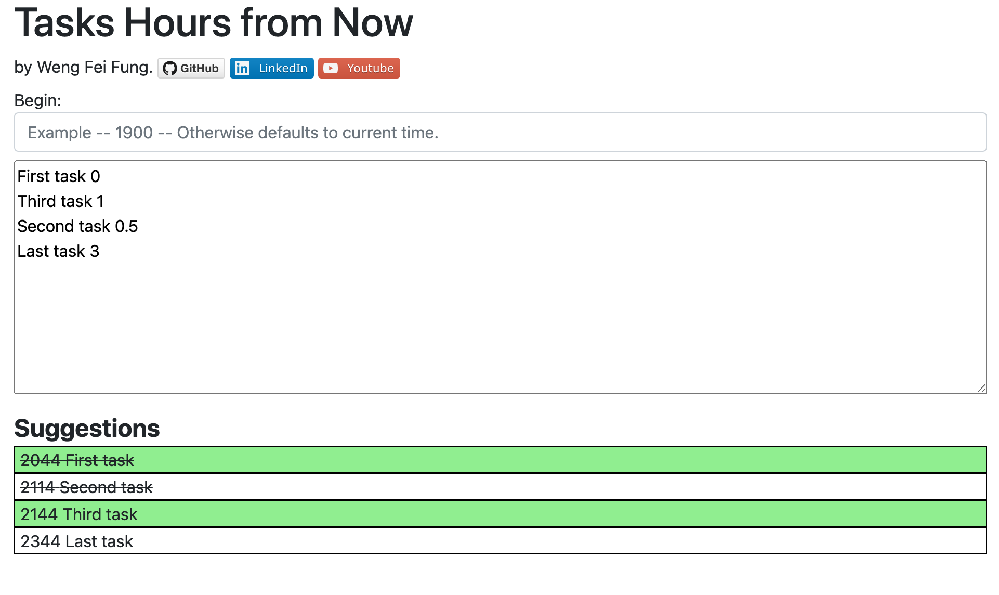

# Tasks Hours from Now

  

:page_facing_up: Description:
---
By Weng Fei Fung. Takes your todo list with the numbers of hours from now when they should be done by, then sorts them in order by military time. Cross out the sorted todo list as you finish your tasks.

:open_file_folder: Table of Contents:
---
- [Description](#description)
- [Preview](#camera-preview)
- [Installation and Usage](#minidisc-installation-and-usage)
- [Future Version](#e-mail-meet-the-team)

:computer: Live Deployment:
---
<a href="https://wengindustry.com/tools/hours-from-now" target="_blank">Check it out</a>

:camera: Preview:
---

## :minidisc: Installation and Usage:
Run as a HTML file. No needed hands-on setup.